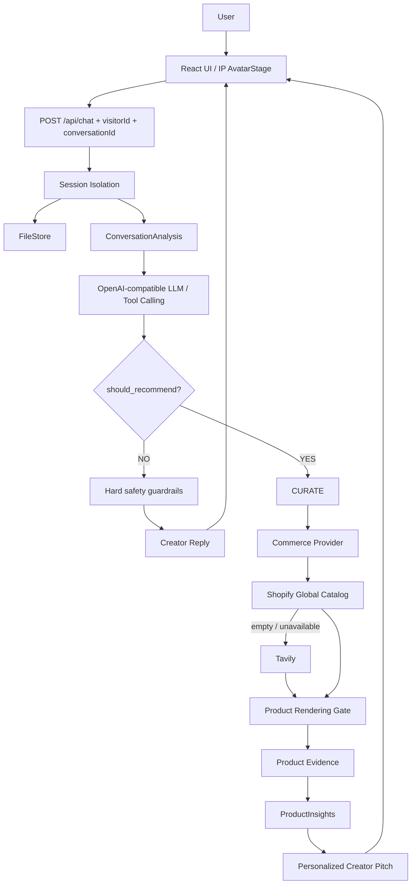

# 小柠：情感陪伴与智能带货虚拟达人

小柠是一个真实 LLM 与真实商品 Provider 驱动的 Lifestyle Virtual Creator：先理解情绪、延续相关上下文和表达自己的生活方式观点，只有用户明确需要挑商品时才进入带货。


## 核心能力

- **Chat**：真实 OpenAI-compatible Tool Calling 对话，默认 1–3 个自然 message segments。
- **Emotional Companion**：识别情绪并自然回应；负面情绪确定性禁止搜索商品。
- **Virtual Creator**：原创 IP AvatarStage、`REACT / SHARE / ASK / CALLBACK / CURATE` 五种互动模式、最近 2–4 条互动与完整历史 drawer。
- **Conversation Management**：`visitorId` 与 `conversationId` 分离；支持新建、列表、切换、删除、刷新恢复，并用 JSON FileStore 在 server restart 后恢复。
- **Memory**：每个 `conversationId` 独立保存 history、明确事实、偏好、话题和 pendingProduct；相关时召回，无关时隔离。
- **Commerce**：由 LLM 根据语义判断是否进入 `CURATE`，Shopify Global Catalog 优先、Tavily fallback；只有 `CURATE && products.length > 0` 才展示 Product Shelf。
- **Product Evidence**：所有卖点来自真实 Provider 字段并保留 evidence；无依据参数、虚构亲测和裸价格不会展示。
- **Product Specifications**：商品卡从真实 Provider 的 title、vendor、options、variants、metadata 等字段解析品牌、型号、版本和具体规格；没有证据就不显示。

这是一个 24 小时 Vibe Coding MVP。它的核心不是商城搜索，而是先陪用户聊天、理解情绪和上下文，只有消费需求明确时才调用真实商品 Provider。


## 产品与技术架构



前端使用 React 18 + Vite；后端使用 Node.js + Express；Vitest 覆盖策略、Session、Provider normalization、Product Gate、ProductInsights 与组件行为；Playwright 仅用于真实浏览器 Visual QA。

## 快速启动

要求 Node.js 18+。

```bash
cp .env.example .env
# 在 .env 中填写 OPENAI_API_KEY；Tavily fallback 需要 TAVILY_API_KEY
npm install
npm run dev
```

打开 <http://localhost:5173/>。后端默认是 <http://localhost:3001/>。

## 环境变量

| 变量 | 是否必需 | 说明 |
| --- | --- | --- |
| `OPENAI_API_KEY` | 对话必需 | OpenAI-compatible API key |
| `OPENAI_BASE_URL` | 可选 | 兼容服务地址 |
| `OPENAI_MODEL` | 可选 | 支持 Tool Calling 的模型；默认 `gpt-3.5-turbo` |
| `TAVILY_API_KEY` | Tavily fallback 必需 | Shopify 无可信结果时的实时网页搜索 |
| `PORT` | 可选 | Express 端口，默认 `3001` |

`.env` 已被 Git 忽略；不要把真实 key 写进代码、README 或测试文件。

## 测试与复现

```bash
# Server + Client tests
npm test

# Production frontend build
npm run build

# 10 个真实 LLM Golden Conversation cases
npm run qa:golden

# 自然度与 Prompt 压缩验收（5 个真实场景，含 10 轮连续对话）
npm run qa:naturalness

# Emotional Companion + Intelligent Commerce 8 场景 Smoke QA
npm run qa:companion-commerce

# 首次运行 Visual QA 前安装 Chromium
npx playwright install chromium
npm run qa:visual
```

Visual QA 会启动真实 Chromium，调用当前运行的真实前后端，不注入 mock 商品，并生成：

- `artifacts/visual-qa/01-home.png` 至 `09-product-detail.png`
- `artifacts/visual-qa/visual-results.json`
- `artifacts/visual-qa/report.html`

已覆盖 1440、1024、768 和 390 宽度；报告记录 input、interaction mode、emotion、currentTopic、是否进入 commerce、provider、商品数和 PASS/FAIL。

## 真实商品数据与信任边界

Provider 顺序：

1. Shopify Global Catalog MCP
2. Shopify 空结果/不可用时降级 Tavily
3. Product Rendering Gate 过滤文章、攻略、排行榜、搜索页、无具体商品 URL 与重复结果
4. Product Evidence 从 title、description、productType、vendor、tags、options、variants、metadata、price/currency 中保留可追溯信息
5. ProductInsights 只总结证据支持的 selling points 和 specifications，并结合用户当前明确需求生成 personalized reason

0 个可信商品是合法结果。此时小柠会明确说没有找到足够靠谱的具体款，不会补造商品或降低标准。

## 目录

```text
client/
  public/assets/xiaoning-main.png  # 原创 IP Virtual Host
  src/App.jsx                      # AvatarStage、互动、Composer、Shelf
  src/index.css                    # 1440/1024/768/390 响应式视觉
server/src/
  app.js                           # visitor/conversation API + session Map
  fileStore.js                     # JSON persistence across restart
  conversationAnalysis.js          # LLM semantic analysis + hard guardrails
  prompts.js                       # 角色、事实边界、memory relevance
  orchestrator.js                  # 回复/搜索/状态生命周期
  productSearch.js                 # Tavily + Product Gate
  shopifyCatalog.js                # Shopify Global Catalog
  productInsights.js               # Evidence -> specifications/insights -> pitch
  conversationNaturalness.js       # Transcript naturalness metrics
scripts/
  golden-conversation.mjs          # 10 个真实 Golden cases
  naturalness-qa.mjs               # 自然对话与话题切换验收
  companion-commerce-qa.mjs        # Companion + Commerce 真实 Smoke QA
  visual-qa.mjs                    # 浏览器截图与 HTML 报告
docs/
  final-submission.md               # 最终提交文档
  final-report.md
  delivery-outline.md
artifacts/visual-qa/
artifacts/release-screenshots/       # 最终提交文档使用的 9 张截图
artifacts/naturalness-qa/            # 真实自然度验收报告与 transcript
artifacts/companion-commerce-qa/     # Companion + Commerce 真实 QA 与 evidence
```

## 为什么不用重型 Live2D / 实时数字人

24 小时 MVP 的核心风险是对话边界、上下文可信度和商品事实，而不是渲染技术。当前使用原创透明 PNG + CSS 轻微 breathing/state tone，在不引入 CUDA、Live2D、Wav2Lip、MuseTalk、WebRTC、TTS pipeline 的情况下建立稳定的虚拟达人存在感。Avatar 与 LLM/Commerce 状态解耦，后续可替换表现层而不重写核心业务。

## 已知限制

- 这是 24 小时 MVP；运行态 Session 在内存中管理，同时由 JSON FileStore 保存会话和记忆，未引入数据库或账号体系。
- 没有登录、持久化数据库、支付和下单闭环。
- 不是实时 Live2D、口型同步或视频数字人。
- 商品字段依赖外部 Provider；真实商品可能缺少价格、图片或足够证据。
- Shopify/Tavily 和 LLM 都受外部网络、额度与 API 可用性影响。
- 无可信结果时系统选择不推荐，因此某些查询会显示 0 个商品。
- GitHub：<https://github.com/haomingweng3-eng/xiaoning-virtual-creator>

## 更多文档

- [最终提交文档](docs/final-submission.md)
- [开发问题与解决方案](docs/final-report.md)
- [Conversation Management 交付报告](docs/conversation-management-report.md)
- [Companion + Commerce 交付报告](docs/companion-commerce-report.md)
- [最终提交文档大纲](docs/delivery-outline.md)
- [Visual QA 报告](artifacts/visual-qa/report.html)
