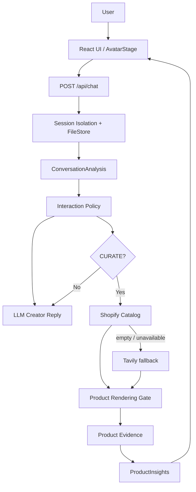

# 小柠：情感陪伴与智能带货虚拟达人

## 1. 项目概述

小柠是一个 Lifestyle Virtual Creator，通过自然对话、情绪理解、上下文记忆和真实商品检索，提供连续互动与个性化商品推荐。她先回应用户当下的情绪和话题，只有用户明确提出挑选商品时才进入带货流程。

这是一个 24 小时 Vibe Coding MVP，重点验证聊天、情感陪伴、记忆隔离、真实商品 Provider 和可复现的前端体验。

## 2. 需求拆解

### 聊天

支持真实 OpenAI-compatible LLM 多轮对话。

### 情感陪伴

识别情绪、情绪强度、用户需要和当前语境，结合相关上下文进行自然回应；负面情绪不会触发商品搜索。

### 虚拟达人

使用小柠原创 IP、稳定人设和生活方式观点，结合 AvatarStage、状态变化和最近互动形成持续的 Creator 体验。

### 智能带货

识别购物意图，在需求明确后调用真实商品 Provider，完成商品筛选、证据提取和个性化推荐。

## 3. 产品方案

核心流程：

```text
用户聊天
  ↓
理解情绪 / 话题 / 用户需求
  ↓
自然互动
  ↓
识别明确消费需求
  ↓
真实商品检索
  ↓
商品筛选 → Product Evidence
  ↓
个性化推荐与商品卡片
```

最终产品截图见第 12 节。主界面由 IP Virtual Host、Recent Interactions、Composer 和 CURATE-only Product Shelf 组成；完整历史和记忆放在辅助抽屉中。

## 4. 技术方案

- Frontend：React 18 + Vite
- Backend：Node.js + Express
- LLM：当前实际接入的 OpenAI-compatible Chat Completions / Tool Calling API
- Conversation：`visitorId` + `conversationId`
- Persistence：JSON FileStore
- Commerce：Shopify Global Catalog，失败或空结果时 Tavily fallback



核心流程是：`ConversationAnalysis → Interaction Policy → Creator Reply / CURATE → Product Provider → Product Gate → ProductInsights → Frontend`。

## 5. 情感陪伴实现

每轮分析包含 `emotion`、`emotion_intensity`、`user_need`、`currentTopic` 和相关记忆，并选择 `REACT / SHARE / ASK / CALLBACK / CURATE`。负面情绪和未成熟的购物意图保持陪伴，不搜索商品；只有明确的消费请求才进入 CURATE。

真实验收场景“今天被领导说了一顿，挺烦的。”进入 REACT，返回自然安慰，没有商品结果。截图：[02-emotional.png](../artifacts/visual-qa/02-emotional.png)。

## 6. 智能带货实现

```text
Shopping Intent
  ↓
CURATE
  ↓
真实 Provider
  ↓
Product Rendering Gate
  ↓
Product Evidence
  ↓
ProductInsights
  ↓
推荐理由
```

只有需求明确时进入商品推荐流程。最近一次真实 smoke QA 中，“那你帮我看看适合跑步的耳机。”进入 `CURATE`，Provider 为 `shopify`，返回 3 个真实商品；商品卡片包含标题、图片、价格/币种、商品 URL（商家字段缺失时保持为空，不补造）。卖点、个性化理由和取舍来自已有 Product Evidence / ProductInsights。

截图：[06-curate.png](../artifacts/visual-qa/06-curate.png)、[09-product-detail.png](../artifacts/visual-qa/09-product-detail.png)。

## 7. 会话与记忆

系统用 `visitorId` 识别同一设备访客，用 `conversationId` 隔离每个会话。每个会话独立保存 history、facts、preferences、currentTopic 和 pendingProduct；记忆只在相关时召回，切换无关话题时不会把旧商品上下文带入。会话支持新建、切换、删除和刷新恢复，JSON FileStore 保存会话记录与持久记忆。

截图：[07-topic-switch.png](../artifacts/visual-qa/07-topic-switch.png) 和 [08-mobile.png](../artifacts/visual-qa/08-mobile.png)。

## 8. 真实数据

商品数据来自真实外部 Provider：本次核心 smoke QA 实际成功使用 Shopify Global Catalog；Shopify 无可信结果或不可用时保留 Tavily fallback。商品价格、图片、URL 和描述等字段来自检索结果，缺失字段保持缺失；商品卖点基于 Product Evidence 提取，不使用 Mock 商品或 LLM 虚构参数。

## 9. 开发过程中遇到的问题与解决思路

### 9.1 电商数据源接入

传统电商 API 存在权限和认证成本。通过 Commerce Provider 抽象接入 Shopify Catalog，并保留 Tavily fallback。

### 9.2 Web 搜索结果质量

网页结果可能混入文章、列表页或信息不完整的数据。增加 Product Rendering Gate，对 URL、标题、重复项和字段完整性进行筛选。

### 9.3 商品推荐可信度

仅有标题和价格不足以支撑推荐。保留 Product Evidence，基于真实字段生成 Selling Points、Personalized Reason 和 Trade-off。

### 9.4 上下文与记忆

早期不同话题之间出现过旧上下文错误召回。拆分 visitor / conversation，增加 currentTopic、Memory relevance 和 pendingProduct 生命周期管理。

### 9.5 产品交互迭代

早期对话、虚拟达人和商品之间关联较弱。重新组织 Conversation、Creator 和 Product Recommendation 的信息层级，并增加桌面、平板和 390px 移动端适配。

## 10. 测试与验证

- Client Vitest：13/13 通过
- Server Vitest：90/90 通过
- Production Build：Vite build exit 0
- Companion / Commerce smoke QA：9/9 PASS
- Visual QA：已有真实浏览器 9/9 PASS，覆盖 1440、1024、768 和 390 宽度
- Secret scan：未发现已跟踪的 `.env`、API key、私钥或 `node_modules`

本次没有重复运行耗时较长的 Golden、自然度和完整 Visual 矩阵；验收依据为现有真实浏览器产物与本次核心 smoke QA。

## 11. 当前实现与工程取舍

当前版本采用轻量 JSON FileStore 和前端 IP Creator，重点验证聊天、情感陪伴、上下文记忆和真实商品推荐的完整链路。未来可以扩展更完整的数据库持久化、更丰富的 Creator 表现形式和更完善的商品数据源；当前不包含登录、支付、下单、Live2D、口型同步或实时视频能力。

## 12. 最终截图

以下截图来自真实运行页面和真实前后端，不使用 Mock 商品：

| 场景 | 文件 |
| --- | --- |
| 首页 | [01-home.png](../artifacts/visual-qa/01-home.png) |
| 情感陪伴 | [02-emotional.png](../artifacts/visual-qa/02-emotional.png) |
| 正向分享 | [03-positive.png](../artifacts/visual-qa/03-positive.png) |
| 普通多轮聊天 | [04-normal-chat.png](../artifacts/visual-qa/04-normal-chat.png) |
| 产生需求但尚未推荐 | [05-pre-commerce.png](../artifacts/visual-qa/05-pre-commerce.png) |
| 明确需求后的真实推荐 | [06-curate.png](../artifacts/visual-qa/06-curate.png) |
| 会话 / 记忆隔离 | [07-topic-switch.png](../artifacts/visual-qa/07-topic-switch.png) |
| 390px 移动端 | [08-mobile.png](../artifacts/visual-qa/08-mobile.png) |
| 商品卖点、推荐理由和证据 | [09-product-detail.png](../artifacts/visual-qa/09-product-detail.png) |

## 13. GitHub

GitHub：当前没有真实 GitHub URL；本地仓库尚未配置 remote，也未执行 push。

运行方式：参考 [README.md](../README.md)。

READY FOR GITHUB（本地提交完成后即可由用户登录 GitHub、创建 remote 并 push）。
