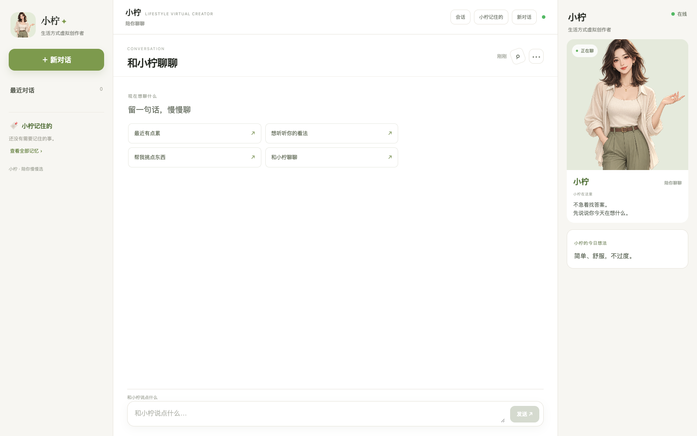
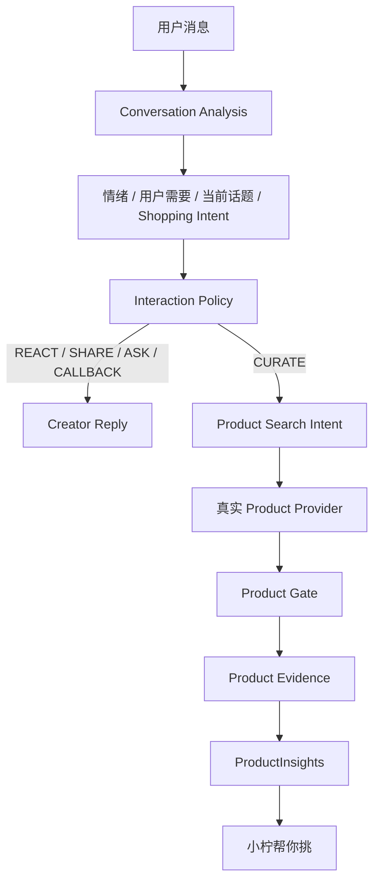
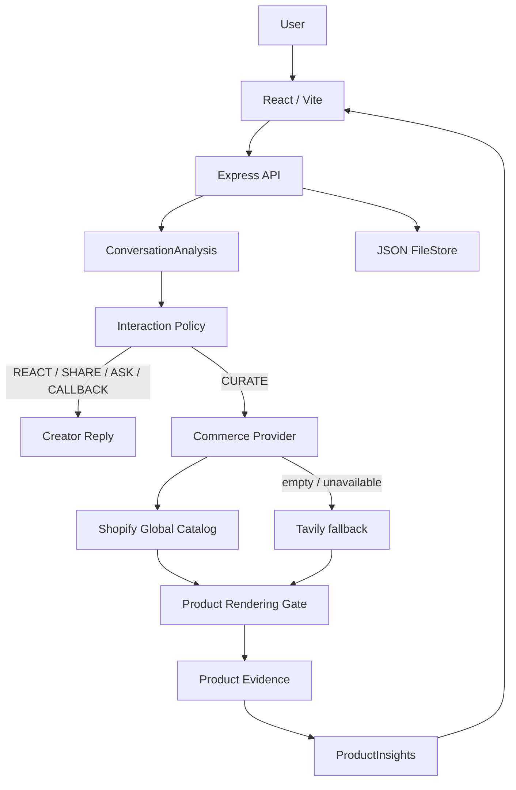
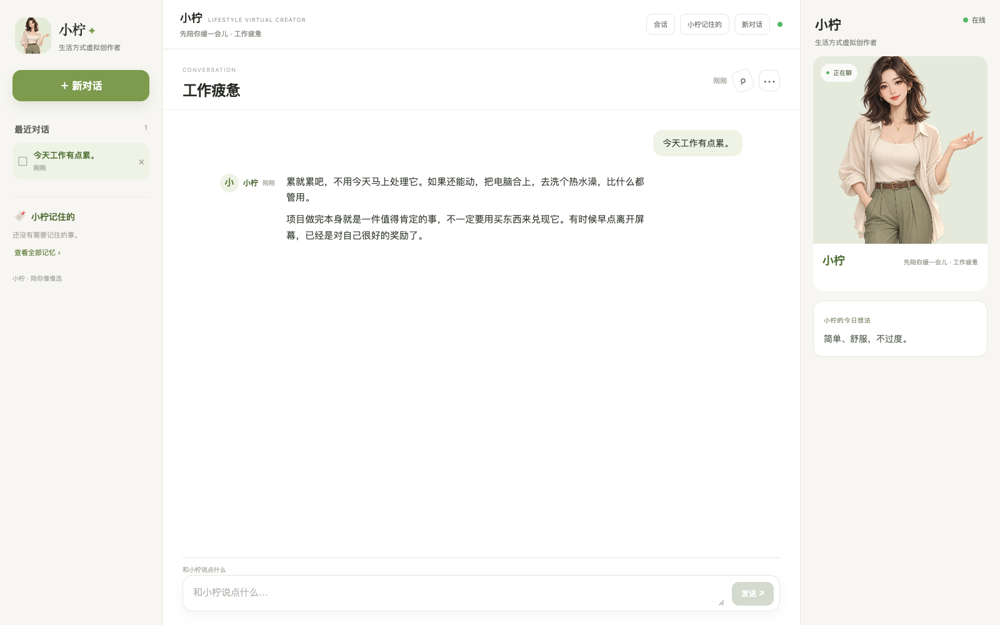
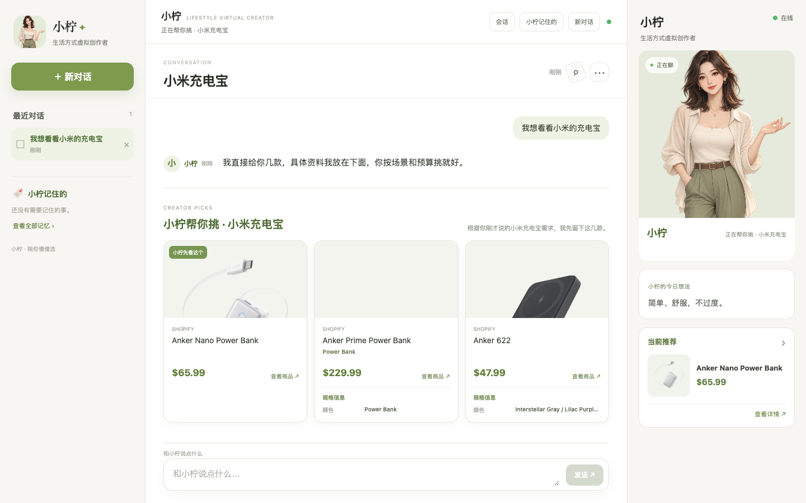
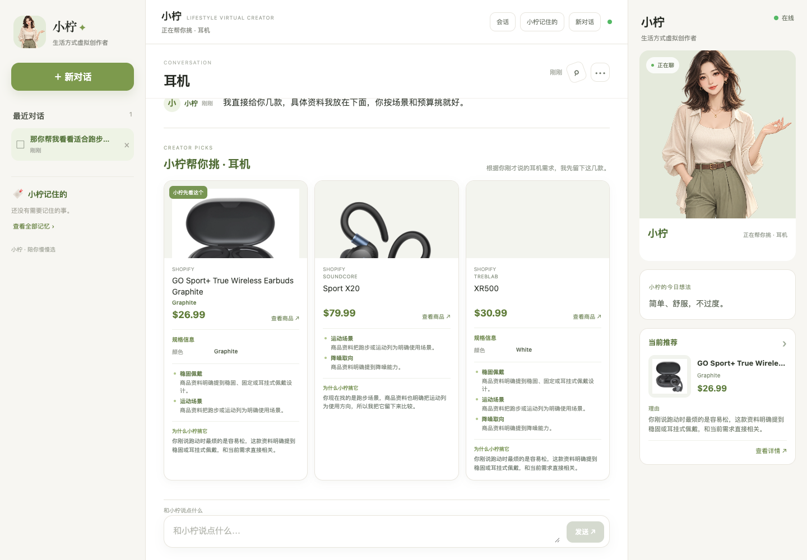

# 小柠：情感陪伴与智能带货虚拟达人

## 1. 项目概述

小柠是一个 Lifestyle Virtual Creator。她通过自然语言对话理解用户的情绪、需求和当前话题，结合相关的 Conversation / Memory 延续关系，并表达自己的生活方式观点。

当用户形成明确的购物需求时，小柠才进入智能带货链路：调用真实商品 Provider，经过商品渲染门、证据提取和 ProductInsights，生成带有规格、卖点与个性化理由的推荐。项目在 24 小时 Vibe Coding 场景下完成，重点验证“陪伴关系 + 可信商品推荐”能否在同一条对话中自然衔接。

## 2. 需求拆解

### 2.1 聊天

使用真实 DeepSeek `deepseek-chat` 完成多轮交流，调用方式是 OpenAI-compatible Chat Completions / Tool Calling。每轮响应可以包含多个自然 message segments，并返回当前互动模式和分析结果供 UI 使用。

### 2.2 情感陪伴

`ConversationAnalysis` 每轮识别 `emotion`、`emotion_intensity`、`user_need`、`topic`、相关上下文和购物意图。Interaction Policy 再选择 `REACT`、`SHARE`、`ASK`、`CALLBACK` 或 `CURATE`，让回复能承接情绪、分享观点、适度追问或回调相关记忆。

### 2.3 虚拟达人

产品包含小柠的 Creator Identity、原创 IP AvatarStage、生活方式观点、连续 Conversation 和相关 Memory。左栏管理对话与记忆，中栏承载聊天，右栏呈现 Creator Presence、今日想法和当前推荐摘要。

### 2.4 智能带货

明确商品需求后，链路为：

`Shopping Intent → CURATE → Product Provider → Product Gate → Product Evidence → ProductInsights → Personalized Recommendation`

### 2.5 真实数据

商品来自 Shopify Global Catalog，Shopify 无可信结果或不可用时降级 Tavily。Provider 返回值经过 normalization 和证据门后才进入商品卡，不用示例商品替代真实数据。

## 3. 产品设计

最终产品是三栏虚拟达人界面：

- 左栏：最近 Conversation、切换/删除、新对话和“小柠记住的” Memory。
- 中栏：聊天记录、情绪/话题状态、`小柠帮你挑` 商品橱窗和 Composer。
- 右栏：Creator IP Avatar、在线状态、Creator Note 和当前推荐摘要。

这样的布局让会话连续性、虚拟达人存在感和商品决策在同一页面中建立联系。



## 4. 核心用户流程



普通互动直接生成 Creator Reply；明确购物需求则进入真实商品检索，再将可核验的商品信息渲染为推荐卡。

## 5. 技术架构

- Frontend：React 18、Vite、CSS；包含三栏布局、AvatarStage、ConversationPane、MessageList、Composer 和 ProductShelf。
- Backend：Node.js、Express；提供聊天、会话、记忆和健康检查 API。
- LLM：当前使用 DeepSeek `deepseek-chat`；通过 OpenAI-compatible Chat Completions / Tool Calling 接入，API key 变量名沿用 `OPENAI_API_KEY`。
- Conversation / Memory：`visitorId` 负责用户级连续性，`conversationId` 负责会话级隔离；JSON FileStore 保存会话、事实、偏好、话题和 pendingProduct。
- Commerce：Shopify Global Catalog 优先，Tavily fallback，之后进入 Product Rendering Gate、Product Evidence 和 ProductInsights。



## 6. 情感陪伴实现

系统使用 LLM 分析当前语境，而不是用固定模板决定所有回复。分析结果包含情绪、强度、用户需要和话题；Interaction Mode 再决定是先回应、分享小柠的看法、提出必要问题、回调相关信息，还是进入商品推荐。

Memory 只在当前话题相关时参与。比如用户表达工作疲劳时，小柠先回应并降低追问压力；用户完成项目时，回复会自然庆祝并允许对话停下；用户重新回到此前话题时，才回调相关信息。



## 7. Conversation 与 Memory

`visitorId` 和 `conversationId` 分开设计：

- `visitorId`：跨会话识别同一用户，承接相关偏好、预算和兴趣。
- `conversationId`：隔离每个具体对话的 history、currentTopic 和 pendingProduct。

当前支持新建、切换、删除和刷新恢复。FileStore 将会话记录和用户级 Memory 写入 JSON 文件，服务重启后可以恢复 MVP 所需的数据。Memory 只保存明确的偏好、预算、兴趣和商品约束，并结合当前话题进行召回。


## 8. 智能带货实现

商品推荐由用户需求和 LLM 的语义判断触发。LLM 输出 `should_recommend`、`recommendation_reason` 和结构化 Shopping Intent；硬规则只承担明确负面情绪、退出购物或整段 LLM/Provider 失败时的边界与安全降级。

ProductInsights 包含：

- `sellingPoints`：有 Provider evidence 支持的值得关注特点。
- `specifications`：品牌、型号、版本、容量、颜色、尺寸及其他真实规格。
- `personalizedReason`：结合用户需求和商品证据形成的推荐理由。
- `tradeoff`：例如真实价格超出预算时的提醒。

商品卡尽可能展示 `brand`、`model`、`variantLabel`、`price`、`currency`、`image`、`merchant`、规格、卖点、推荐理由和商品 URL。规格与 Selling Points 分离；没有真实数据的字段不显示，不用产品常识补齐。



## 9. 商品数据真实性

当前 Provider 顺序为：

1. Shopify Global Catalog MCP。
2. Shopify 无可信结果或不可用时的 Tavily fallback。
3. Product Rendering Gate 过滤文章、攻略、排行榜、搜索页、无具体商品 URL 和重复结果。
4. Product Evidence 从 `title`、`description`、`productType`、`vendor`、`tags`、`options`、`variants`、`metadata`、价格和货币等真实字段提取依据。
5. ProductInsights 只输出证据支持的规格、卖点、个性化理由和取舍提醒。

型号和规格解析遵循 Provider 数据。例如 title 中真实出现 `iPhone 17 (Unlocked)` 时才会展示型号和版本；options / variants 返回具体容量或颜色时才展示相应规格。LLM 不会凭产品常识补充 256GB、5G、芯片或材质等信息。



## 10. 开发过程中遇到的问题与解决思路

### 10.1 商品数据源接入

单一搜索源会受到权限、认证和结果可用性的影响。解决方案是抽象 Commerce Provider，使用 Shopify Global Catalog 作为优先源，并保留 Tavily fallback。

### 10.2 搜索结果质量

Web Search 可能返回文章、列表页、排行榜或不完整商品。解决方案是增加 Product Rendering Gate，只让有具体商品 URL、可识别字段且能通过去重的结果进入 UI。

### 10.3 商品信息不足

早期商品只有标题和价格，推荐无法解释。解决方案是增加 Product Evidence、ProductInsights 和 Product Specification normalization，将型号、规格、卖点、个性化理由和 evidence 分开处理。

### 10.4 Conversation 与 Memory 隔离

多轮话题切换时，旧场景曾被错误带入新话题。解决方案是分离 `visitorId` / `conversationId`，保存 currentTopic，并在召回前判断 Memory relevance，避免把跑步装备等无关上下文带入手机或工作话题。

### 10.5 前端产品形态

早期界面对 Conversation、Creator 和商品的关系表达不足。解决方案是收敛为响应式三栏产品：左侧 Conversation / Memory，中间 Chat / Recommendation，右侧 Creator；同时针对 1440、1024、768 和 390 宽度做适配。

## 11. 测试与验证

以下数字来自当前仓库已有测试和真实 QA 结果：

| 检查 | 结果 |
| --- | --- |
| Server Vitest | 13 files / 106 tests passed |
| Client Vitest | 17 tests passed |
| Client production build | Vite exit 0 |
| Companion + Commerce QA | 9/9 PASS |
| Naturalness QA | 5/5 PASS |
| Visual QA | 9/9 PASS，覆盖 1440 / 1024 / 768 / 390 |
| 真实 LLM + Shopify smoke | `我想看看小米的充电宝` → `should_recommend=true`、`CURATE`、3 个真实商品 |
| Secret scan | 未发现已跟踪的 key、私钥或 `.env` |
| Git diff check | PASS |

单元测试中的 Provider 和 LLM 调用使用 mock 来验证分支和边界；真实 smoke 和 Visual QA 验证当前运行环境的实际 LLM、Provider、前端和商品展示链路。

## 12. 工程取舍

24 小时 MVP 优先完成真实 LLM、Conversation / Memory、情感交互、真实商品 Provider 和 evidence-backed commerce。当前使用 JSON FileStore 和 CSS/PNG AvatarStage，适合验证产品链路；后续可替换为数据库、账号体系和更完整的数字人表现层。

## 13. 运行方式

项目要求 Node.js 18+：

```bash
cp .env.example .env
# 在 .env 中填写 DeepSeek API key（变量名为 OPENAI_API_KEY）；Tavily fallback 需要 TAVILY_API_KEY
npm install
npm run dev
```

打开 <http://localhost:5173/>。生产前端构建和测试命令：

```bash
npm test
npm run build
npm run start
```

真实 QA 命令：

```bash
npm run qa:golden
npm run qa:naturalness
npm run qa:companion-commerce
npm run qa:visual
```

## 14. 最终截图

截图均位于 `docs/screenshots/`，来自当前真实 UI；商品截图使用真实 Provider 返回商品，没有为截图注入 mock 商品。

| 场景 | 截图 |
| --- | --- |
| 三栏首页 | [01-home.png](screenshots/01-home.png) |
| 情感陪伴 | [02-emotional.png](screenshots/02-emotional.png) |
| 正向分享 | [03-positive.png](screenshots/03-positive.png) |
| 普通多轮聊天 | [04-normal-chat.png](screenshots/04-normal-chat.png) |
| 产生需求但尚未推荐 | [05-pre-commerce.png](screenshots/05-pre-commerce.png) |
| 明确需求后的真实推荐 | [06-curate.png](screenshots/06-curate.png) |
| 商品型号、规格、价格、卖点和推荐理由 | [07-product-detail.png](screenshots/07-product-detail.png) |
| 390px 移动端 | [08-mobile.png](screenshots/08-mobile.png) |
| 会话 / 记忆隔离 | [09-topic-switch.png](screenshots/09-topic-switch.png) |

## 15. 已知限制

- 运行态 Session 在内存中管理，同时由 JSON FileStore 保存；没有数据库、登录、支付或下单闭环。
- 商品信息依赖外部 Provider，可能缺少图片、价格或规格；无可信结果时系统不生成商品卡。
- 当前不是 Live2D、口型同步或实时视频数字人。
- 真实 LLM、Shopify、Tavily 受网络、额度和 API 可用性影响。

## 16. GitHub

公开仓库：<https://github.com/haomingweng3-eng/xiaoning-virtual-creator>

- Branch：`main`
- 最终提交：`24edbcf docs: refresh final screenshots`
