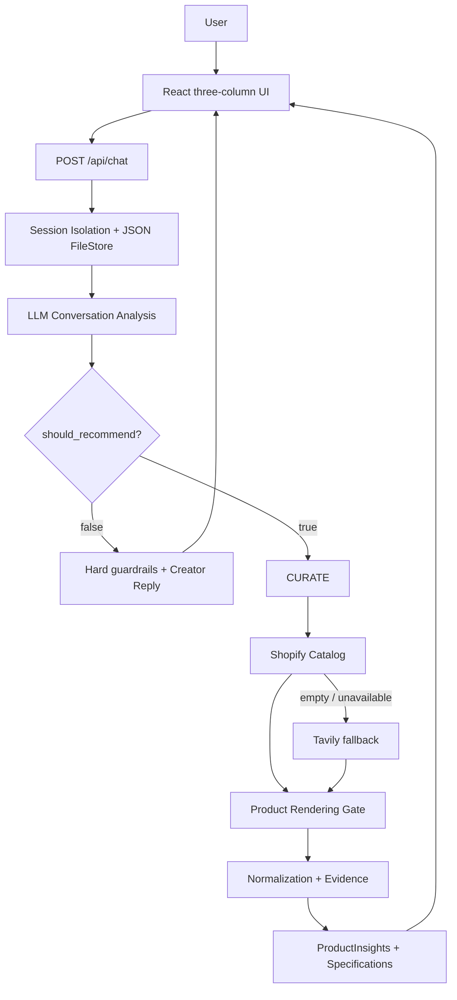

# 小柠：情感陪伴与智能带货虚拟达人

## 1. 交付结论

当前版本已冻结功能和 UI，完成三栏虚拟达人界面、响应式适配、真实 LLM 对话、会话记忆隔离、真实商品 Provider、商品证据和 Product Specification 展示。

小柠的推荐决策由 LLM 结合语义、上下文和用户需求判断；规则只负责硬边界（例如明确负面情绪不搜索）以及整段 LLM/Provider 失败时的安全降级。不会仅靠关键词把用户挡在推荐流程外。

## 2. 产品能力

- 情感陪伴：识别情绪、需求、话题和相关记忆，支持 `REACT / SHARE / ASK / CALLBACK / CURATE`。
- 智能带货：明确购物需求时进入 `CURATE`，调用 Shopify Global Catalog，必要时降级 Tavily。
- 商品卡：展示真实图片、标题、价格、Selling Points、个性化理由和商品链接。
- Product Specification：从 Provider 的 `vendor`、`title`、`productType`、`options`、`variants`、`tags`、`metadata`、`description` 解析品牌、型号、版本、容量、颜色、尺寸等；每条规格保留 evidence，无证据不补。
- 会话管理：`visitorId` 与 `conversationId` 分离，支持新建、切换、删除和刷新恢复。
- 记忆隔离：按 conversation 保存 history、facts、preferences、currentTopic 和 pendingProduct，只在相关时召回。
- 响应式 UI：桌面三栏、平板收缩布局、390px 移动布局；Composer 的 Enter 发送、Shift+Enter 换行。

## 3. 技术方案

- Frontend：React 18 + Vite + CSS
- Backend：Node.js + Express
- LLM：当前配置的 OpenAI-compatible Chat Completions / Tool Calling
- Persistence：JSON FileStore
- Commerce：Shopify Global Catalog → Tavily fallback → Product Rendering Gate → Product Evidence → ProductInsights

## 4. 推荐可信度与数据边界

推荐商品来自真实 Provider 返回值。Product Gate 会排除文章、列表页、搜索页、重复结果和没有具体商品 URL 的结果；缺失价格、图片、品牌或规格时保持缺失。

Product Specifications 与 Selling Points 分离：规格回答“具体是什么配置”，卖点回答“有什么值得关注的特点”。型号、版本、容量、颜色等不会因产品常识自动补全，所有显示规格都必须能回溯到 Provider evidence。

当 LLM 判断用户已经明确需要推荐时，系统会直接检索并展示结果；只有没有可信商品或外部服务失败时才使用安全降级文案。用户历史中已经保存的旧 fallback 文本不会被刷新后的前端自动改写，因为历史记录保存的是当时的文本，不保存当时的商品数组。

## 5. 最小真实验收

本次最终收尾没有重复运行耗时较长的 Golden、自然度和完整 Visual 矩阵，只做核心回归和一次真实链路 smoke：

| 检查 | 结果 |
| --- | --- |
| Server Vitest | 13 files / 106 tests passed |
| Client Vitest | 17 tests passed |
| Client production build | Vite exit 0 |
| 已有 Companion + Commerce 报告 | 9/9 PASS |
| 已有 Naturalness 报告 | 5/5 PASS |
| 已有 Visual QA 报告 | 9/9 PASS，覆盖 1440/1024/768/390 |
| 当前真实 LLM + Shopify smoke | `我想看看小米的充电宝` → `should_recommend=true`、`CURATE`、3 个真实商品 |
| `git diff --check` | PASS |
| Secret scan | 未发现已跟踪的 key、私钥或 `.env` |

单元测试中的 Provider 和 LLM 调用使用 mock，是为了验证分支和边界；上表另列的真实 smoke 才验证当前运行环境的实际 LLM + Shopify 链路。

## 6. 最终截图

以下文件位于 `docs/screenshots/`。其中 `01-home.png`、`06-curate.png`、`07-product-detail.png`、`08-mobile.png` 是当前运行页面重新生成的真实浏览器截图，其余场景来自已通过的真实 Visual QA 产物。

| 场景 | 截图 |
| --- | --- |
| 首页 | [01-home.png](screenshots/01-home.png) |
| 情感陪伴 | [02-emotional.png](screenshots/02-emotional.png) |
| 正向分享 | [03-positive.png](screenshots/03-positive.png) |
| 普通多轮聊天 | [04-normal-chat.png](screenshots/04-normal-chat.png) |
| 产生需求但尚未推荐 | [05-pre-commerce.png](screenshots/05-pre-commerce.png) |
| 明确需求后的真实推荐 | [06-curate.png](screenshots/06-curate.png) |
| 会话 / 记忆隔离 | [09-topic-switch.png](screenshots/09-topic-switch.png) |
| 390px 移动端 | [08-mobile.png](screenshots/08-mobile.png) |
| 商品规格、卖点和推荐理由 | [07-product-detail.png](screenshots/07-product-detail.png) |

## 7. 已知限制

- 运行态 Session 在内存中管理，同时由 JSON FileStore 保存；没有数据库、登录、支付或下单闭环。
- 商品数据依赖外部 Provider，Provider 可能缺少图片、价格或规格；无可信结果时系统会选择不推荐。
- 当前不是 Live2D、口型同步或实时视频数字人。
- 真实 LLM、Shopify、Tavily 受网络、额度和 API 可用性影响。

## 8. GitHub 发布状态

仓库已创建为公开仓库并成功 push：

GitHub：<https://github.com/haomingweng3-eng/xiaoning-virtual-creator>

- Visibility：Public
- Branch：`main`
- Push：PASS
